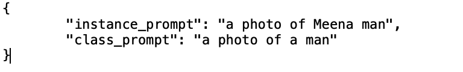
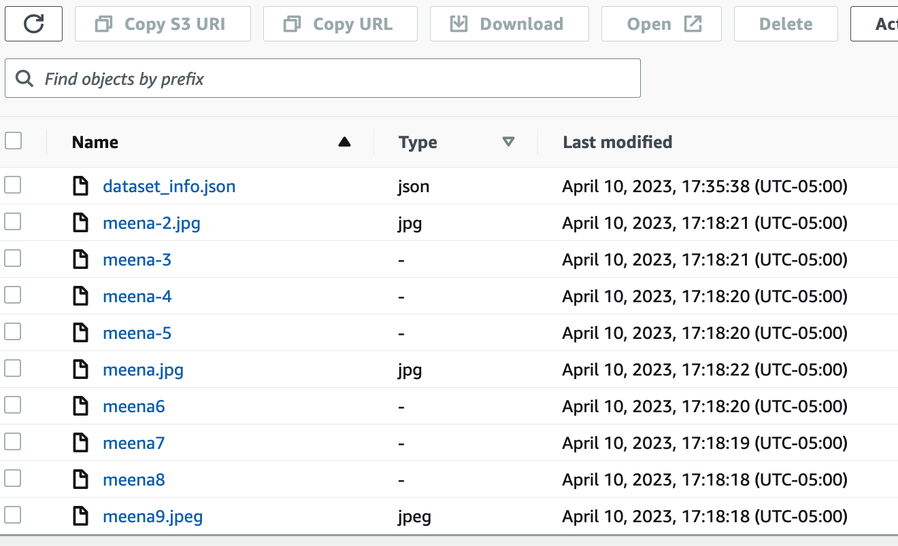
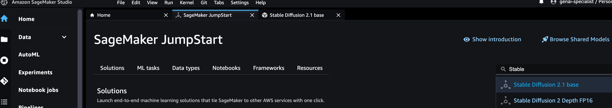
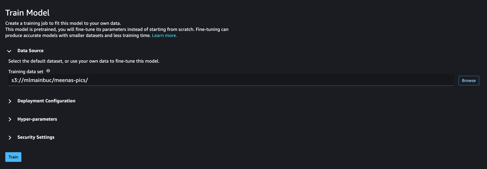
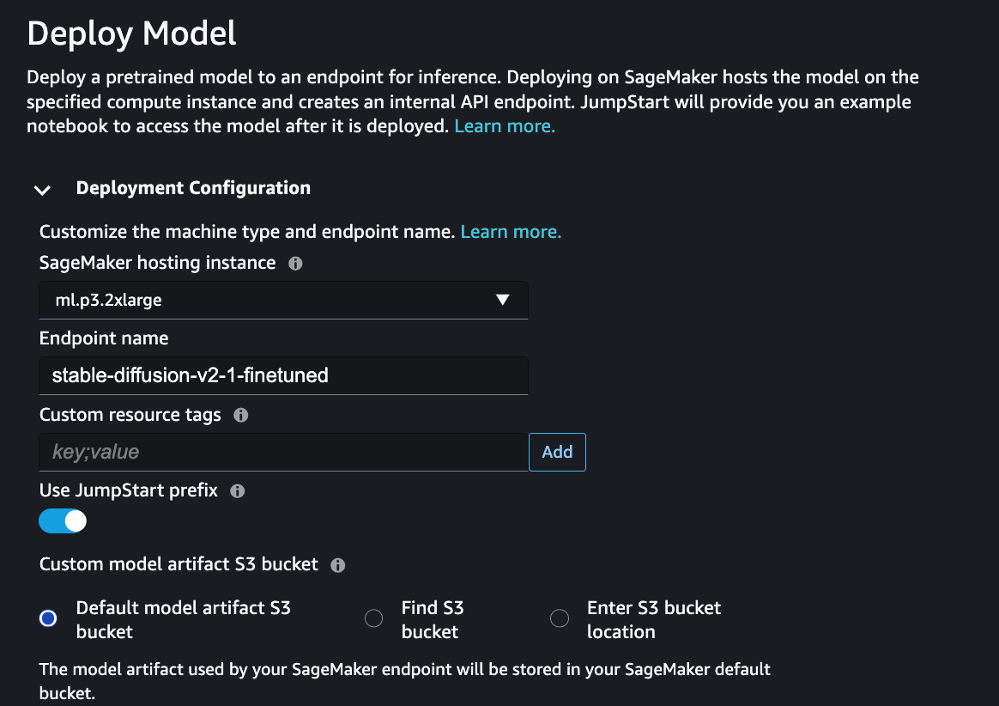

# Make your own avatar using SageMaker Foundation Model Hub

## Pre-requisites

1. AWS Account
2. Acess to Foundation Model hub within the AWS Account - If you do not have access request access as per the guidelines provided in <https://wiki.amazon.com/bin/view/SageMaker-JumpStart/FoundationModels>
3. Use us-east-1 for your lab

## Run the cloud formation teemplate

1. Open up a terminal in your machine and clone the repo
```git clone https://github.com/thandavm/create_your_own_avatar.git```
2. Log in to your AWS Console -> CloudFormation
3. Use the [`template.yml`](./template.yml) to create a CloudFormation stack.  Pick the default VPC and Subnets as parameters

## Create the data set

1. Create a json file simialar to the below and name it dataset_info.json

2. Upload the images and the json file on to an Amazon S3 bucket


## Fine tune Stable Diffusion Model

1. Log in to your SageMaker Studio [created as a part of the cloud formation template]
2. Click on SageMaker Jumpstarts -> Models, Notebooks and solutions
3. Search for Stable Diffusion and select "Stable Diffusion 2.1 base"

4. Click on the "Train" tab
5. For the training dataset, select the Amazon S3 prefix where you uploaded your data


6. Click on "Train"

This will start the fine tuning of the Stable diffusion model and will take ~10 - 12 mins to fine tune

## Deploy the fine tuned Model

1. Once fine tuning is complete, click on the "Deploy" tab
2. Enter a name for the fine tuned model,  keep the rest the same

3. Click on "Deploy".  this will take ~7 -8 minutes to complete
4. Copy the end point name,  This is required to be used in the next step

## Play with the model and create your own avatars

1. Back in your local laptop go the folder where you cloned the repo
2. Ensure that python and pip are both installed. If using a Mac you may find this link useful
3. Change directory cd create_your_own_avatar and check for the requirements.txt file as well as the app.py file
4. Install the required sdk
```pip install -r requirements.txt```
5. Open the app.py and add your access key, secret key and model end point name
6. run the app
```streamlit run app.py```
7. Unleash your imagination in the text area.  Few sample below
 "meena man as 10 year old boy"
